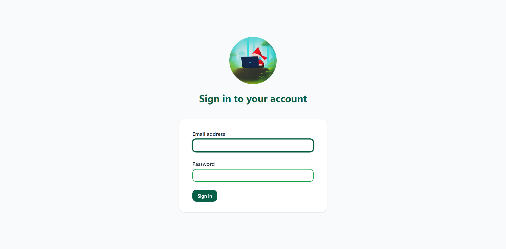
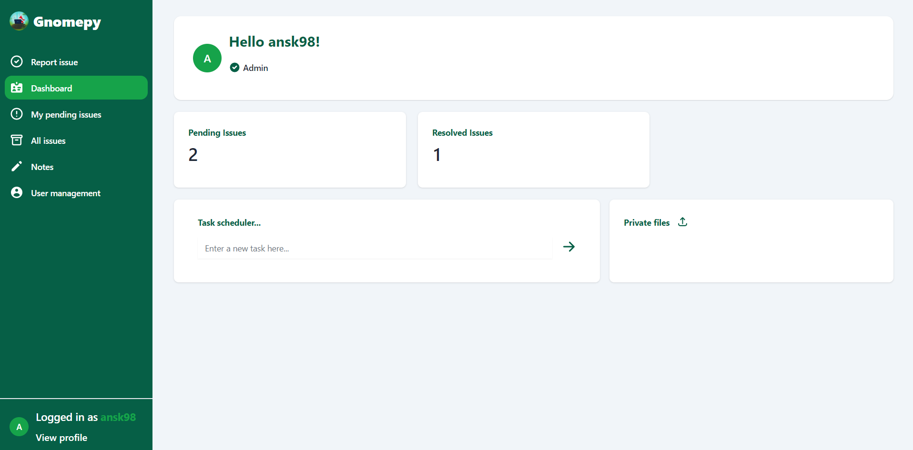
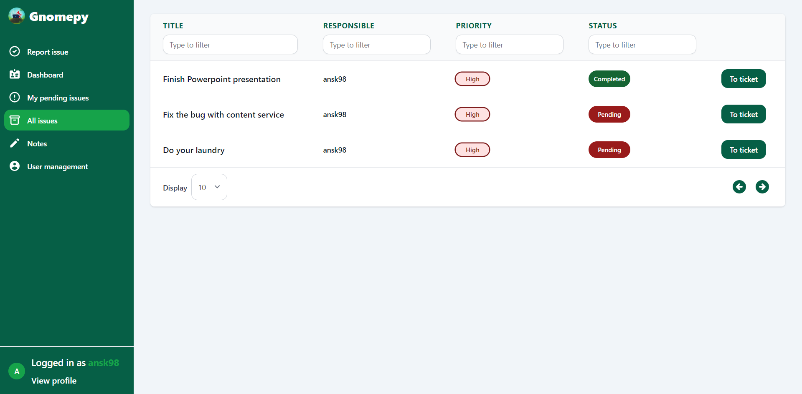
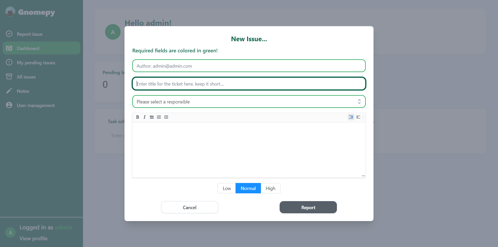
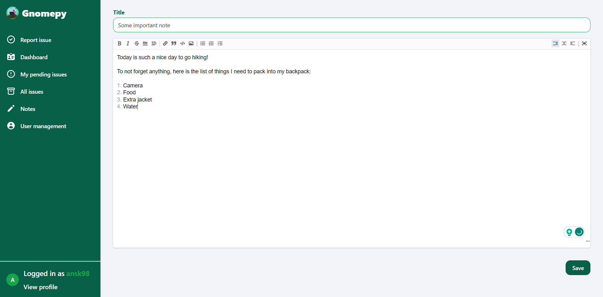
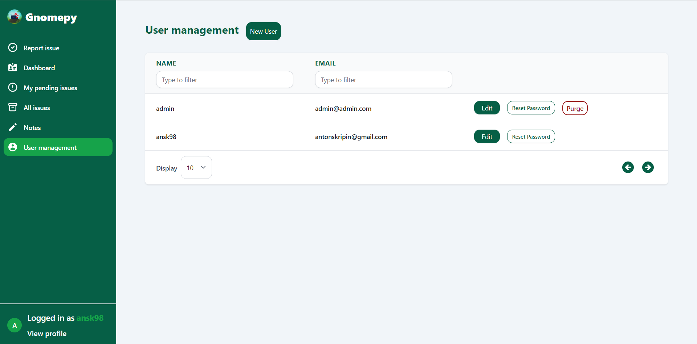
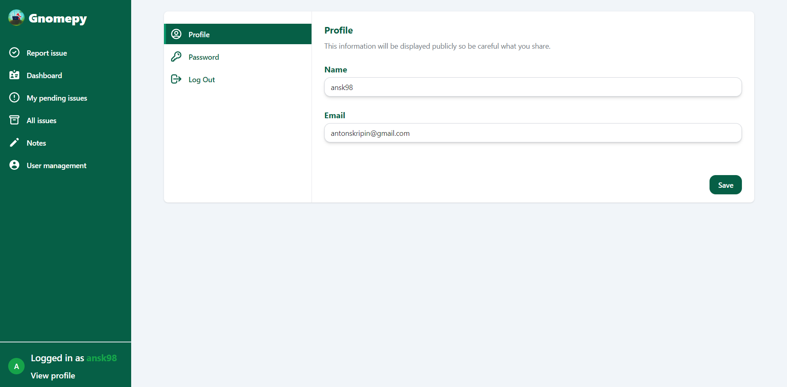

# Gnomepy
Ticket Management System – a comprehensive one-stop solution for managing all your household and internal requests and issues.

## Introduction
This web application is a viable alternative to well-known services like Freshdesk, offering a self-hosted solution for managing customer inquiries and support requests.

## Features

1. Create tickets with ease using our markdown editor and enjoy the added convenience of file uploads.
2. Markdown-based notebook, featuring convenient to-do lists to help you stay organized and on top of your tasks.
3. Our design is fully responsive, optimized to accommodate various screen sizes ranging from mobile devices all the way up to 4k displays.
4. Skip the burden of complex setups and simply use our readily available Docker image for easy and hassle-free deployment.
5. Our system is built with ease of use in mind, featuring a simple and logical workflow that ensures a seamless experience for users of all levels.

## Local deployment with docker
After deploying this application locally using the provided configuration, you can access it at http://localhost:5000.

```
version: "3.1"

services:
  postgres:
    container_name: postgres
    image: postgres:latest
    restart: always
    volumes:
      - ./gnomepy/db:/data/db
    environment:
      POSTGRES_USER: ansk98
      POSTGRES_PASSWORD: 1234
      POSTGRES_DB: gnomepy

  client:
    container_name: gnomepy
    image: antonsk98/gnomepy:latest
    ports:
      - 5000:5000
    restart: on-failure
    depends_on:
      - postgres
    environment:
      PORT: 5000
      DB_USERNAME: ansk98
      DB_PASSWORD: 1234
      DB_HOST: postgres
      BASE_URL: "http://localhost:5000"
```
Default credentials for first log in:
**User:** admin@admin.com
**Password:** 1234

## Motivation
1. Unlock the potential for growth and development by exploring exciting technologies like React and Next.js.
2. Embrace the challenge of learning something new and take your skills to the next level!
2. Finally manage your household requests and to-do tasks, all in one place.
3. Boost my portfolio with practical projects that improve the daily life and make the life easier.

## Application in action
Log in view

Dashboard page

All issues overview

New issue modal

Notes tab

User management page

Profile settings and management

##### **Remark:** This project is inspired by [Peppermint](https://github.com/Peppermint-Lab/peppermint). 